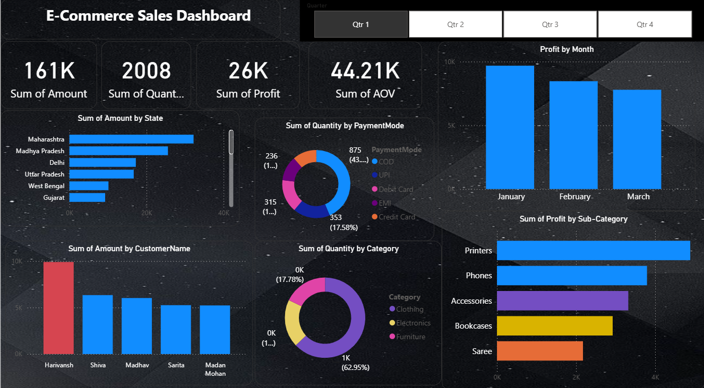

<div align="center">

# 📊 E-Commerce Sales Dashboard

### Business Intelligence Dashboard for Retail Sales Analytics

*A production-inspired Power BI dashboard transforming raw e-commerce transactions into interactive business intelligence through KPI monitoring, customer analytics, geographic insights, and profitability analysis.*


</div>

---

# 📖 Overview

Business leaders don't need more spreadsheets—they need clear, actionable insights.

This project demonstrates how Power BI can transform raw e-commerce transaction data into an executive-ready dashboard that enables stakeholders to monitor sales performance, identify revenue drivers, understand customer behavior, and support data-driven business decisions.

The dashboard combines interactive visualizations, KPI tracking, and business analytics to provide a complete view of retail performance.

---

# 📸 Dashboard Preview

<p align="center">

</p>

---

# ✨ Dashboard Features

## 📈 Executive KPIs

Monitor business performance through key metrics including:

- Total Revenue
- Total Profit
- Total Quantity Sold
- Average Order Value

---

## 🌍 Geographic Performance

Analyze sales across different Indian states to identify:

- High-performing regions
- Revenue concentration
- Regional growth opportunities

---

## 💳 Payment Analytics

Understand customer purchasing preferences through:

- Cash on Delivery
- UPI
- Credit Card
- EMI

---

## 📦 Product Performance

Evaluate:

- Most Profitable Categories
- Top Performing Products
- Revenue Contribution
- Profit Distribution

---

## 👥 Customer Insights

Identify:

- High-value customers
- Customer contribution
- Revenue concentration
- Repeat purchasing behaviour

---

## 📅 Time-Series Analysis

Track business performance over time through:

- Monthly Profit Trends
- Revenue Changes
- Seasonal Performance

---

# 📊 Key Business Insights

### 💰 Revenue Performance

- ₹161K Total Revenue
- ₹26K Total Profit
- 2,008 Units Sold
- ₹44.21K Average Order Value

---

### 🌍 Geographic Insights

Sales are concentrated across a few major states, with Maharashtra and Madhya Pradesh contributing the highest revenue, followed closely by Delhi and Uttar Pradesh.

---

### 💳 Customer Payment Behaviour

Digital payment methods dominate overall transactions, with Cash on Delivery and UPI accounting for the largest share of purchases.

---

### 📦 Product Intelligence

Printers and Phones generate the highest profit, while Accessories, Bookcases, and Sarees continue to contribute significantly to overall business performance.

---

### 👥 Customer Analysis

A relatively small group of customers contributes a disproportionately large share of total revenue, reflecting a classic Pareto distribution and highlighting opportunities for customer retention strategies.

---

### 📈 Profit Trend

Profitability declines steadily between January and March, indicating potential seasonal effects or changing purchasing behaviour that warrants further investigation.

---

# 🛠 Tools & Technologies

| Category | Technology |
|-----------|------------|
| Dashboard | Power BI |
| Language | DAX |
| Data Modeling | Power Query |
| Visualization | Interactive Charts |
| Analytics | Business Intelligence |

---

# 📈 Dashboard Components

| Dashboard Element | Purpose |
|-------------------|----------|
| KPI Cards | Executive performance overview |
| Sales by State | Geographic analysis |
| Payment Distribution | Customer payment behaviour |
| Monthly Profit | Trend analysis |
| Profit by Category | Product profitability |
| Top Customers | Customer segmentation |
| Quantity Sold | Sales performance |

---

# 🎯 Business Questions Addressed

The dashboard helps answer questions such as:

- Which products generate the highest profit?
- Which customers contribute the most revenue?
- Which regions drive business growth?
- Which payment methods are most popular?
- How does profitability change over time?
- Are sales concentrated among a small customer base?
- Which product categories deserve additional investment?

---

# 🚀 Skills Demonstrated

- Power BI Dashboard Development
- Interactive Report Design
- DAX Calculations
- Business Intelligence
- KPI Development
- Customer Analytics
- Sales Analytics
- Geographic Analysis
- Executive Reporting
- Data Storytelling

---

# 📂 Repository Structure

```
E-Commerce-Sales-Dashboard
│
├── Dashboard.pbix
├── dashboard-screenshot.png
└── README.md
```

---

# 💡 Why This Project?

The objective of this project was to move beyond static reporting and build an interactive dashboard capable of supporting real business decisions.

Rather than simply visualizing sales data, the dashboard focuses on uncovering customer behaviour, identifying profitability drivers, monitoring regional performance, and communicating actionable insights through intuitive visualizations suitable for business stakeholders.
